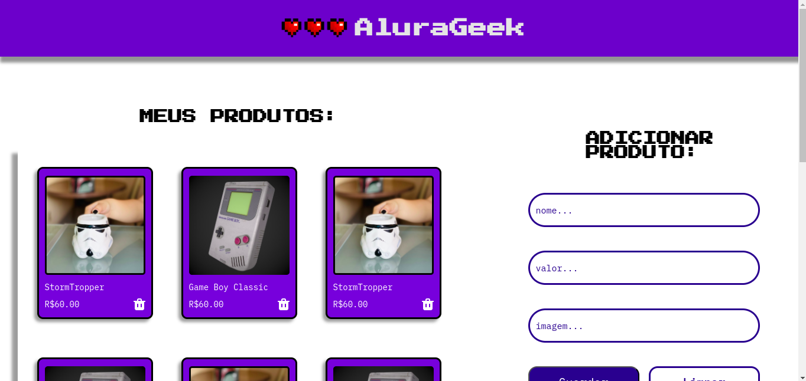

# Challenge_AluraGeek

# Sobre o projeto

https://challenge-alura-geek-psi.vercel.app/

Alura Geek é um e-commerce gamer que foi feito no curso da Alura com Oracle chamado ONE - Especialização Front-End.

# Tecnologias utilizadas

- JavaScript
- HTML 
- SCSS
- Json Server

# Autor
Álisson josé de Santana

https://www.linkedin.com/in/%C3%A1lisson-santana/
